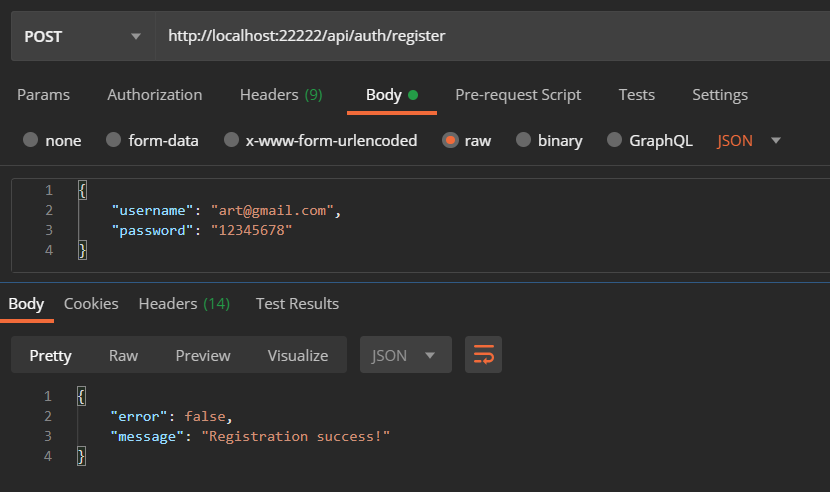
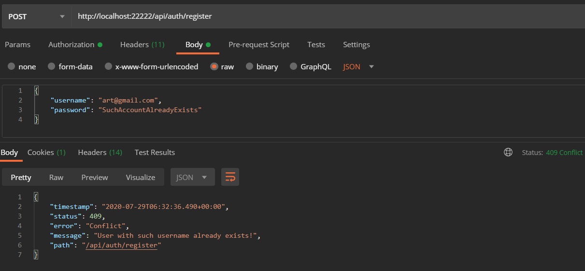
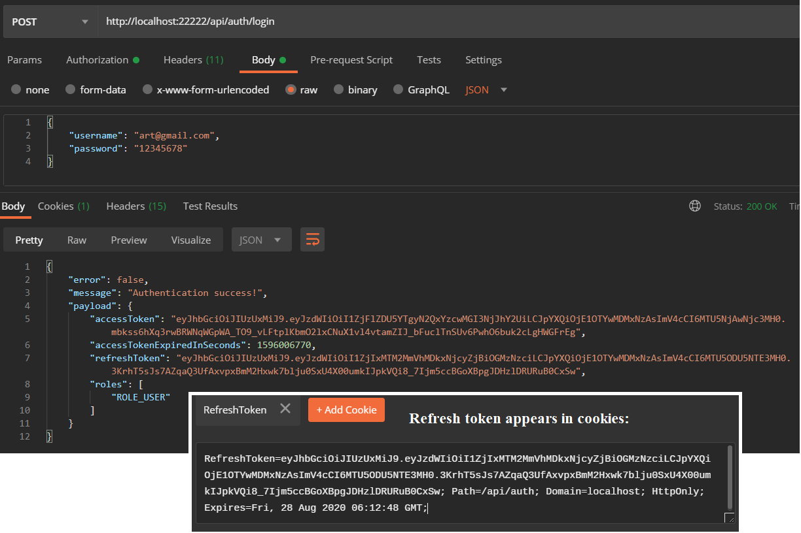
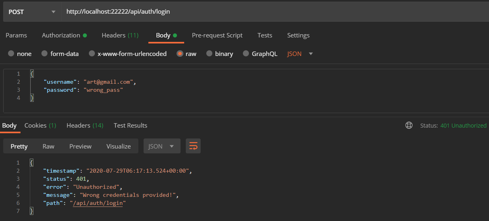
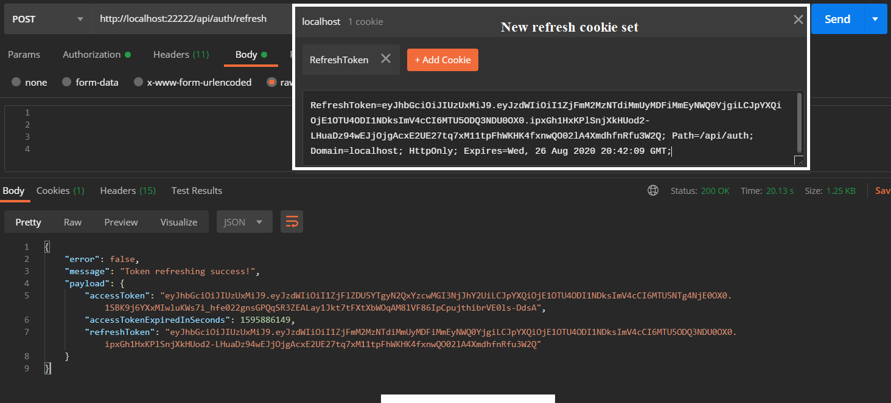
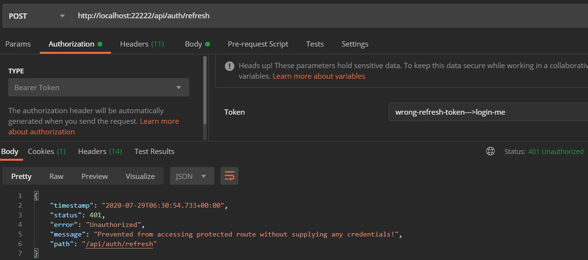
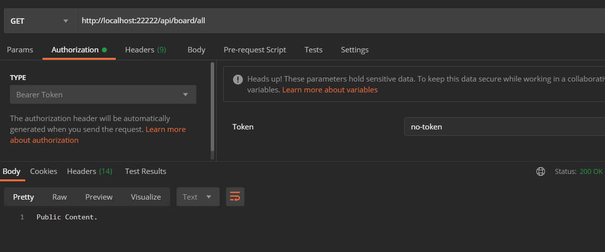
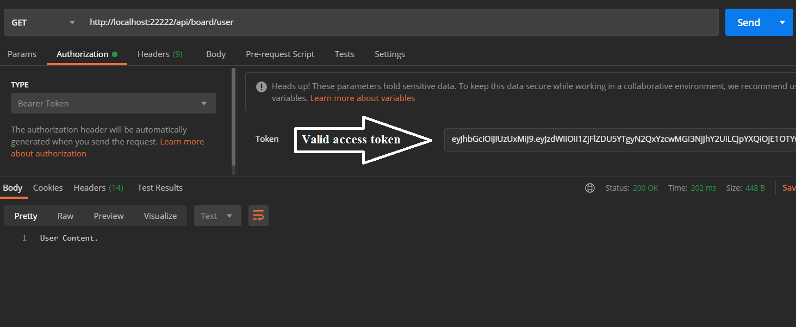
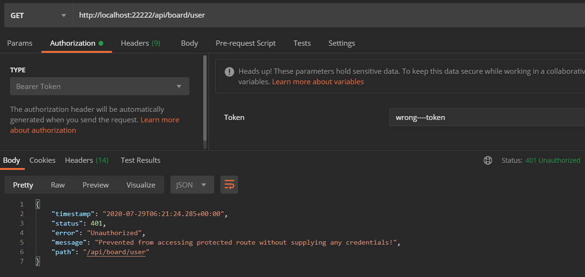
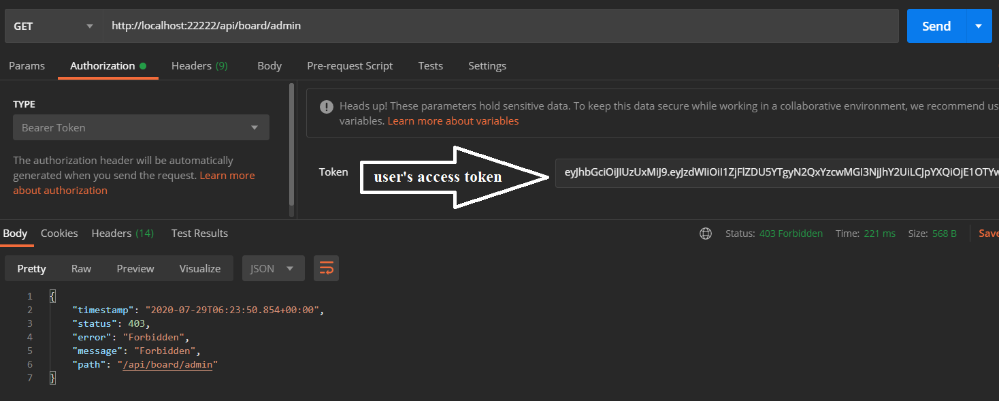

# Spring jwt template

Simple Spring JWT Authentication template with some routes to test.

I deployed demo to Heroku and left api opened to everyone, so feel free to test.

Check [api documentation](https://spring-jwt-template.herokuapp.com/swagger-ui/index.html?configUrl=/v3/api-docs/swagger-config).

Link to api --> https://spring-jwt-template.herokuapp.com/

## Tech stack:
* Java 11.
* Spring (Boot, Security, Data).
* Mongodb.
* Java JWT.
* Lombok.
* Swagger.

### Requests

#### Registration

##### Registration success

  

##### Registration failure

  

#### Login

##### Login success

  

##### Login failure

  

#### Refresh

##### Refresh success

  

##### Refresh failure

  

#### Accessing content

##### Public content accessing

  

##### Protected route accessing with valid token and authorities

  

##### Protected route accessing with wrong token

  

##### Protected route accessing without required authority

  

That's it. If you found some bug, please, open issue or better create pull request. Thanks!
	
***Best Regards, Arti Tsv!***